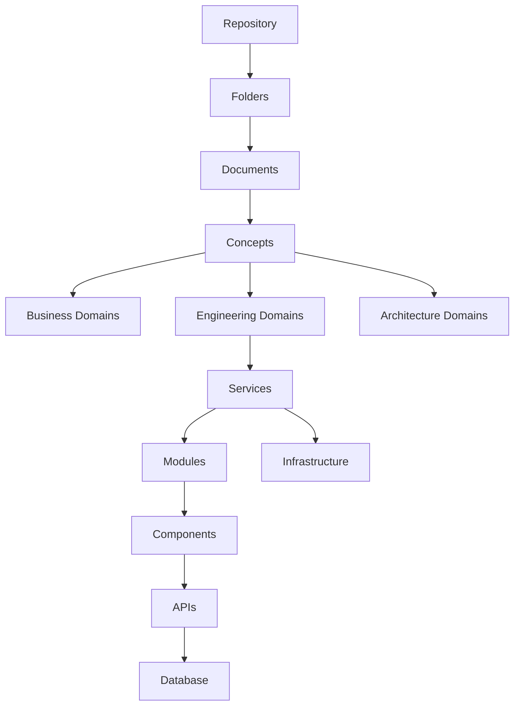

# 05 Repository Knowledge Graph

Generated for Phase -1 repository knowledge acquisition. This report is descriptive only and contains no architecture recommendations.

## Graph Overview
- Repository: `/Users/l.paunikar/Desktop/Download-Lalit/consultants-dashboards`
- Folders: `10`
- Documents: `1533`
- Concept groups: `9`

## Hierarchy

## Concept Index
| Concept Group | Top Concepts | Documents Containing Group |
|---|---|---|
| Architecture Concepts | version (1051), architecture (861), workflow (446), event (405), service (404), domain (309), capability (241), module (214), gateway (127), microservice (60), outbox (19), bounded context (10), resolver (9) | 1241 |
| Engineering Concepts | model (769), repository (659), api (601), test (509), build (292), deploy (223), backend (127), next (124), frontend (111), migration (96), endpoint (90), react (52), route (32), alembic (8), sqlalchemy (3) | 1317 |
| AI Concepts | ai (1219), eaios (703), workflow (446), rag (402), operating system (401), agent (287), knowledge (274), prompt (191), codex (31) | 1242 |
| Quality Concepts | test (511), quality (340), evidence (178), verification (169), acceptance (145), regression (110), checklist (96), qa (72), definition of done (29) | 772 |
| Business Concepts | user (437), product (411), service (382), role (280), package (273), organisation (202), license (189), tenant (153), persona (83), organization (74), onboarding (71), invitation (69), client (60), corporate (60), employee (60), people (53), workspace (48), platform owner (13) | 896 |
| Security Concepts | auth (588), audit (391), authentication (233), permission (193), session (164), rbac (162), token (155), encryption (131), secret (108), authorization (78), password (72), jwt (63), cors (5) | 697 |
| Operational Concepts | release (292), runtime (279), deployment (225), monitoring (221), observability (189), logs (178), health (162), readiness (137), rollback (96), vercel (18), railway (11) | 686 |
| Compliance Concepts | governance (786), compliance (750), audit (427), risk (293), policy (292), controls (157), privacy (94), hipaa (28) | 984 |
| Platform Concepts | platform (442), capability (241), configuration (199), identity (197), shared (130), master data (31), multi-tenant (25), multi product (1) | 565 |

## Domain To Document Edges
| Domain | Documents |
|---|---|
| API Gateway | api-gateway/.pytest_cache/README.md |
| Authentication Service | services/auth-service/.pytest_cache/README.md |
| Delivery Management | docs/delivery/PROJECT_STATE.md, docs/delivery/README.md, docs/delivery/RELEASE_CHECKLIST.md, docs/delivery/RELEASE_ENGINEERING_SPECIFICATION.md, docs/delivery/ROADMAP.md, docs/delivery/TESTING_STRATEGY.md |
| Delivery Milestones | docs/milestones/milestone-2-identity-onboarding/ACCEPTANCE_CRITERIA.md, docs/milestones/milestone-2-identity-onboarding/ARCHITECT_APPROVAL.md, docs/milestones/milestone-2-identity-onboarding/AUDIT_LOG_SPECIFICATION.md, docs/milestones/milestone-2-identity-onboarding/CHANGELOG.md, docs/milestones/milestone-2-identity-onboarding/DEPLOYMENT_GUIDELINES.md, docs/milestones/milestone-2-identity-onboard… |
| Enterprise AI Operating System | ai/ACTIVE_MODULE.md, ai/ARCHITECTURE_DECISION_RECORDS copy.md, ai/ARCHITECTURE_DECISION_RECORDS.md, ai/CODEX.md, ai/DECISION_LOG.md, ai/DEPENDENCY_GRAPH.md, ai/DO_NOT_TOUCH.md, ai/EAIOS_ARCHITECTURE.md, ai/EXECUTION_LIFECYCLE.md, ai/FILE_MAP.md, ai/KNOWN_ISSUES.md, ai/MASTER_ARCHITECT.md, ai/PRODUCTION_ISSUES.md, ai/PROJECT_STATE.md, ai/README.md, ai/REPOSITORY_STRUCTURE.md, ai/SYSTEM_THINKING_MO… |
| Frontend Console | nuetra-frontend/IMPLEMENTATION_SUMMARY.md, nuetra-frontend/LANDING_PAGE_TESTING.md, nuetra-frontend/node_modules/@alloc/quick-lru/readme.md, nuetra-frontend/node_modules/@eslint-community/eslint-utils/README.md, nuetra-frontend/node_modules/@eslint-community/regexpp/README.md, nuetra-frontend/node_modules/@eslint/eslintrc/README.md, nuetra-frontend/node_modules/@eslint/js/README.md, nuetra-fronte… |
| Governance | docs/governance/01_DELIVERY_LIFECYCLE.md, docs/governance/02_DEFINITION_OF_READY.md, docs/governance/03_DEFINITION_OF_DONE.md, docs/governance/04_SPRINT_GOVERNANCE.md, docs/governance/05_ARCHITECTURE_REVIEW_PROCESS.md, docs/governance/06_CODE_REVIEW_STANDARD.md, docs/governance/07_QUALITY_GATES.md, docs/governance/08_TESTING_STRATEGY.md, docs/governance/09_RELEASE_GOVERNANCE.md, docs/governance/1… |
| Identity Platform | docs/platform/identity/AUTHENTICATION_SPECIFICATION.md, docs/platform/identity/IAM_SPECIFICATION.md, docs/platform/identity/IDENTITY_PLATFORM.md |
| Platform Capabilities | docs/platform/AUDIT_LOG_SPECIFICATION.md, docs/platform/AUTH_SPECIFICATION.md, docs/platform/ERROR_HANDLING_SPECIFICATION.md, docs/platform/FILE_STORAGE_SPECIFICATION.md, docs/platform/IAM_CAPABILITY_ENGINE_SPECIFICATION.md, docs/platform/LOGGING_MONITORING_SPECIFICATION.md, docs/platform/NOTIFICATION_SPECIFICATION.md, docs/platform/PEOPLE_ACCESS_SPECIFICATION.md, docs/platform/PLATFORM_CAPABILIT… |
| Product Bible | docs/products/PRODUCT.md, docs/products/README.md, docs/products/zestiva-one-platform/product-bible/00_EXECUTIVE_SUMMARY.md, docs/products/zestiva-one-platform/product-bible/01_VISION_AND_STRATEGY.md, docs/products/zestiva-one-platform/product-bible/02_BUSINESS_CAPABILITIES.md, docs/products/zestiva-one-platform/product-bible/APPENDICES/EDO_PRODUCTION_ENGINEERING_MODE.md, docs/products/zestiva-on… |
| Profile Service | services/profile-service/.pytest_cache/README.md |
| Repository Foundation | .pytest_cache/README.md, AGENTS.md, README.md, codex/M1/EPIC-001/backend/README.md, codex/M1/EPIC-001/database/README.md, codex/M1/EPIC-001/deployment/README.md, codex/M1/EPIC-001/frontend/README.md, codex/M1/EPIC-001/tests/README.md, codex/MASTER_DEBUG.md, codex/MASTER_EXECUTION.md, codex/MASTER_REFACTOR.md, codex/MASTER_RELEASE.md, codex/MASTER_REVIEW.md, codex/README.md, docs/adr/README.md, do… |
