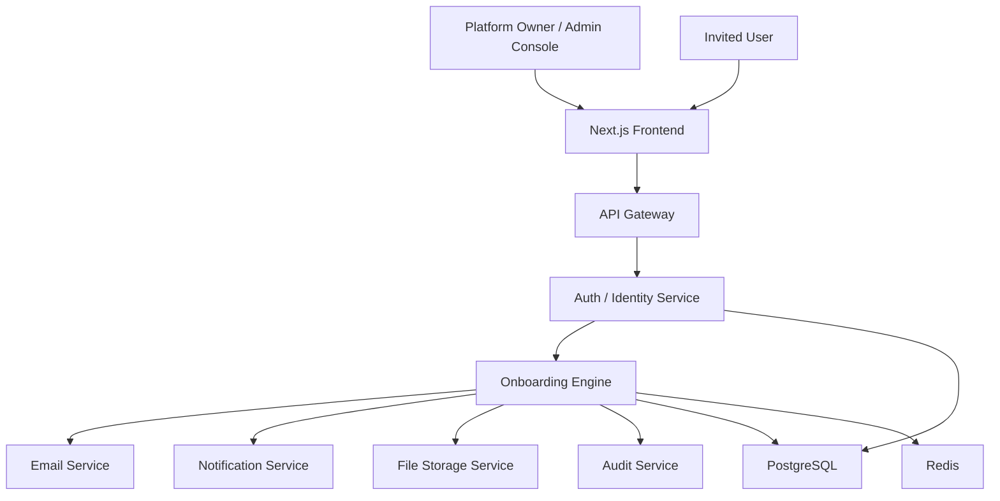
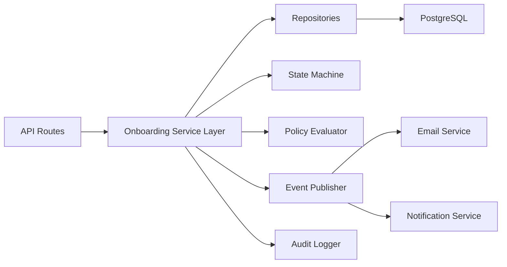
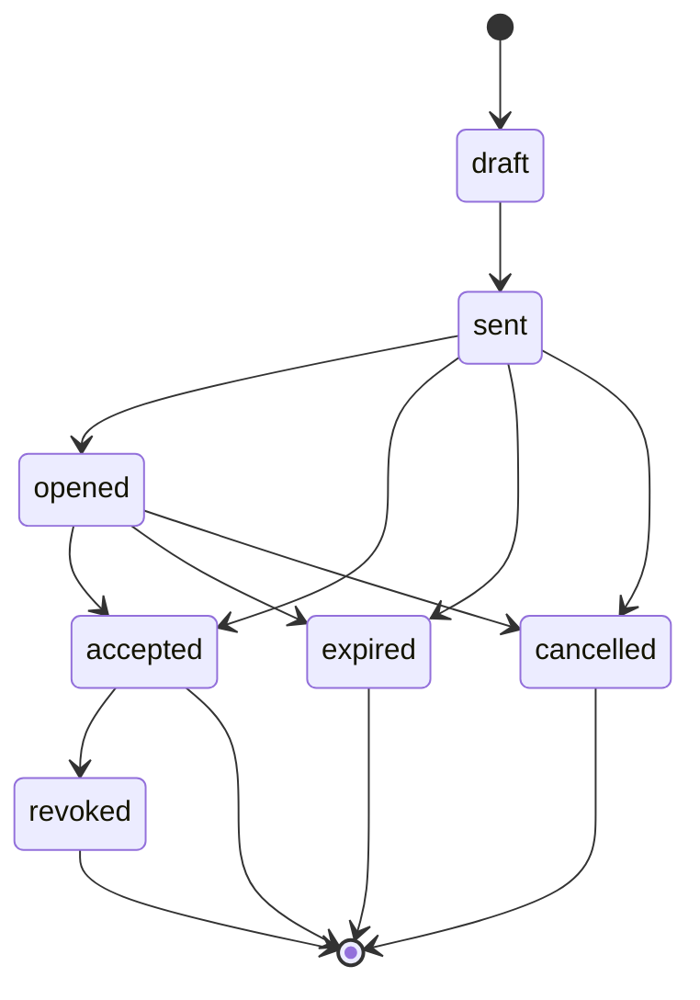
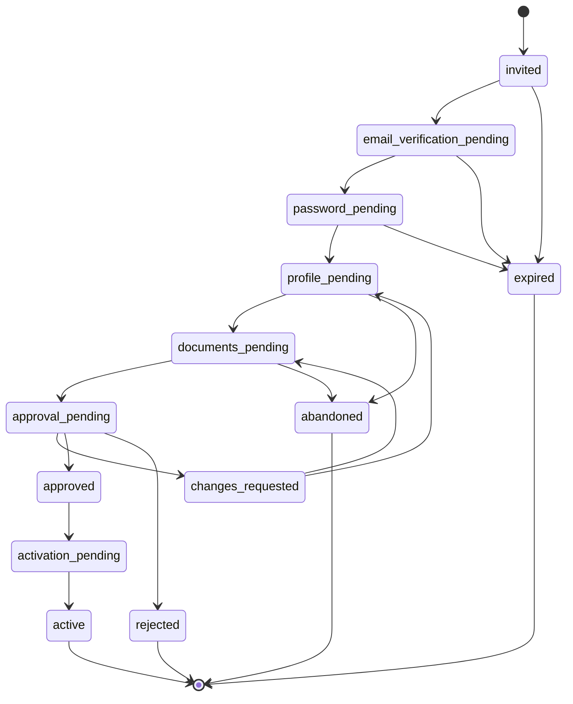
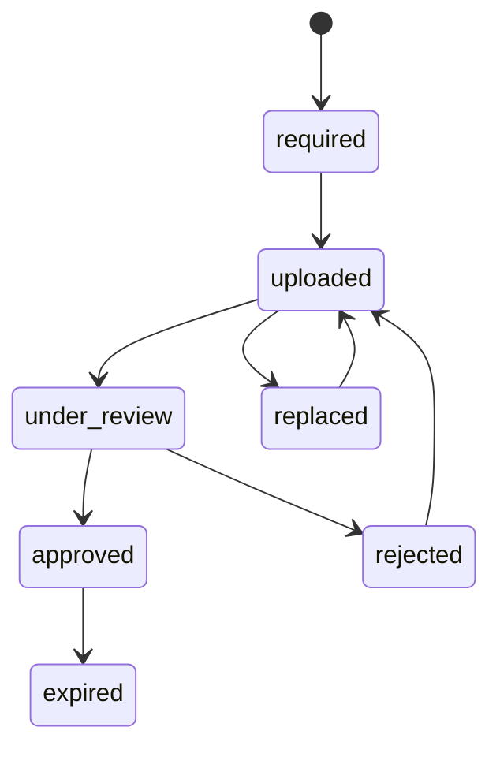
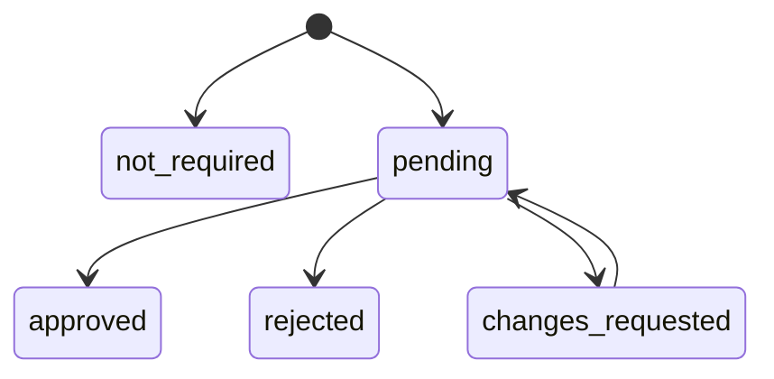

# Milestone 2 TDS: Identity & Onboarding Platform

## Document Control

| Field | Value |
| --- | --- |
| Product | Zestiva Enterprise Platform |
| Company | Zestiva LLP |
| Products Supported | Nuetra, FitEatsy, future Zestiva products |
| Milestone | Milestone 2: Identity & Onboarding Platform |
| Document Type | Technical Design Specification |
| Status | Draft for Review |
| Implementation Status | Not Started |
| Last Updated | 2026-07-14 |

## 1. Architecture Goal

Create a reusable, template-driven onboarding platform that supports every current and future role without role-specific implementations.

The system must support:

- Invitation.
- Email verification.
- Password setup through shared PasswordService.
- Dynamic profile collection.
- Document upload and review.
- Approval.
- Activation.
- Login through the existing role-neutral authentication pipeline.

This TDS does not authorize implementation. It defines the proposed technical architecture for approval.

## 2. Design Constraints

1. Do not modify authentication behavior without a separate high-risk impact analysis.
2. Do not duplicate PasswordService or password hashing.
3. Do not hardcode role-specific onboarding flows.
4. Do not authorize by role name alone.
5. Do not store business profile fields in `users`.
6. Do not store documents directly in PostgreSQL.
7. Do not create cross-service database foreign keys.
8. Every mutation must audit.
9. Every list endpoint must paginate.
10. Every workflow state transition must be explicit and validated.

## 3. System Context



## 4. Service Boundary

Recommended service ownership:

| Capability | Owning Service | Notes |
| --- | --- | --- |
| Identity record | Auth / Identity Service | One identity per human. |
| Password setup | Auth / Identity Service | Must use shared PasswordService. |
| Role and permission assignment | Auth / Identity Service | Permission-based, scoped grants. |
| Onboarding templates | Auth / Identity Service initially | Can later become dedicated Onboarding Service. |
| Onboarding runs | Auth / Identity Service initially | Close to identity activation transaction. |
| Documents metadata | Auth / Identity Service initially | File bytes owned by File Storage Service. |
| Email delivery | Email Service | Event-driven. |
| Notifications | Notification Service | Event-driven. |
| Audit records | Existing Audit model/service | Mutations and transitions. |

Initial recommendation: implement within Auth / Identity Service as a bounded onboarding module because activation and identity lifecycle are tightly coupled. Keep module boundaries clean so it can be extracted into a dedicated Onboarding Service later.

## 5. Business Architecture

### 5.1 Domain Capabilities

1. Template Management.
2. Invitation Management.
3. Verification.
4. Password Setup.
5. Profile Step Collection.
6. Document Collection.
7. Document Review.
8. Approval Workflow.
9. Activation.
10. Audit and Reporting.

### 5.2 Domain Objects

| Object | Purpose |
| --- | --- |
| Onboarding Template | Defines the reusable onboarding workflow. |
| Template Version | Immutable published template snapshot. |
| Template Step | One configurable step in a workflow. |
| Template Field | One field collected in a profile/document step. |
| Document Requirement | Required/optional document rule. |
| Invitation | Secure invitation sent to an email. |
| Onboarding Run | A user-specific execution of a template. |
| Onboarding Step Instance | Runtime status of one step. |
| Submitted Field Value | Captured structured profile data. |
| Submitted Document | Metadata for uploaded document. |
| Approval Decision | Review decision and reason. |
| Activation Event | Final activation result. |

## 6. Technical Architecture



### 6.1 Layers

| Layer | Responsibility |
| --- | --- |
| Routes | Validate request, resolve actor, authorize permission, delegate to service. |
| Schemas | Request/response DTO validation. |
| Service Layer | Business rules, state transitions, transactions, event emission. |
| Repository Layer | Persistence, scoped queries, pagination, locking where needed. |
| State Machine | Enforce allowed transitions. |
| Policy Evaluator | Decide required steps, approval need, activation eligibility. |
| Event Publisher | Emit notification/email/audit events. |

## 7. Workflow Engine

### 7.1 Template Definition

Templates must define:

- `template_key`
- `version`
- `status`
- `role_scope`
- `product_scope`
- `organization_scope`
- `steps`
- `field_definitions`
- `document_requirements`
- `approval_policy`
- `activation_policy`
- `notification_policy`
- `expiry_policy`

### 7.2 Runtime Execution

On invitation acceptance:

1. Resolve invitation.
2. Validate token.
3. Resolve template version.
4. Create or link identity record.
5. Create onboarding run.
6. Create step instances from template.
7. Move run to `verification_pending` or next required state.

### 7.3 Policy Evaluation

Policy evaluation determines:

- Required steps.
- Optional steps.
- Field visibility.
- Document requirements.
- Reviewer assignment.
- Activation readiness.
- Permission grants.

Policies must be data-driven and testable.

## 8. State Machines

### 8.1 Invitation State Machine



Allowed terminal states:

- `accepted`
- `expired`
- `cancelled`
- `revoked`

### 8.2 Onboarding Run State Machine



### 8.3 Document State Machine



### 8.4 Approval State Machine



## 9. Database Design

This is a proposed schema. No migration is generated in this architecture phase.

### 9.1 Tables

#### `onboarding_templates`

| Column | Type | Notes |
| --- | --- | --- |
| `id` | UUID PK | Template identity. |
| `template_key` | varchar unique | Stable key. |
| `name` | varchar | Display name. |
| `description` | text | Optional. |
| `status` | varchar | `draft`, `active`, `retired`. |
| `created_by_user_id` | UUID | Actor. |
| `updated_by_user_id` | UUID | Actor. |
| `created_at` | timestamptz | Required. |
| `updated_at` | timestamptz | Required. |
| `deleted_at` | timestamptz nullable | Soft delete. |

Indexes:

- Unique `template_key`.
- Index `status`.
- Index `deleted_at`.

#### `onboarding_template_versions`

| Column | Type | Notes |
| --- | --- | --- |
| `id` | UUID PK | Version identity. |
| `template_id` | UUID FK | Same-service FK. |
| `version` | integer | Immutable version number. |
| `status` | varchar | `draft`, `published`, `retired`. |
| `role_scope` | jsonb | Role keys supported. |
| `product_scope` | jsonb | Product keys/IDs supported. |
| `organization_scope` | jsonb | Organization policy. |
| `approval_policy` | jsonb | Approval rules. |
| `activation_policy` | jsonb | Activation rules. |
| `notification_policy` | jsonb | Notification rules. |
| `published_at` | timestamptz nullable | Publish timestamp. |
| `created_at` | timestamptz | Required. |
| `updated_at` | timestamptz | Required. |

Constraints:

- Unique `(template_id, version)`.

#### `onboarding_template_steps`

| Column | Type | Notes |
| --- | --- | --- |
| `id` | UUID PK | Step identity. |
| `template_version_id` | UUID FK | Version owner. |
| `step_key` | varchar | Stable key. |
| `step_type` | varchar | `verification`, `password`, `profile`, `documents`, `approval`, `activation`. |
| `title` | varchar | User-facing. |
| `description` | text | Optional. |
| `is_required` | boolean | Required step. |
| `sort_order` | integer | Step order. |
| `visibility_policy` | jsonb | Conditional visibility. |
| `validation_policy` | jsonb | Step-level validation. |

Constraints:

- Unique `(template_version_id, step_key)`.

#### `onboarding_template_fields`

| Column | Type | Notes |
| --- | --- | --- |
| `id` | UUID PK | Field identity. |
| `step_id` | UUID FK | Step owner. |
| `field_key` | varchar | Stable key. |
| `label` | varchar | User-facing. |
| `field_type` | varchar | `text`, `select`, `multi_select`, `date`, `file_ref`, etc. |
| `is_required` | boolean | Required field. |
| `options_source` | varchar nullable | Master Data category key or enum source. |
| `validation_rules` | jsonb | Field rules. |
| `sort_order` | integer | Field order. |

Constraints:

- Unique `(step_id, field_key)`.

#### `onboarding_document_requirements`

| Column | Type | Notes |
| --- | --- | --- |
| `id` | UUID PK | Requirement identity. |
| `template_version_id` | UUID FK | Version owner. |
| `document_key` | varchar | Stable key. |
| `label` | varchar | User-facing. |
| `is_required` | boolean | Required document. |
| `allowed_file_types` | jsonb | MIME types/extensions. |
| `max_file_size_mb` | integer | Size limit. |
| `expiry_required` | boolean | Whether document expires. |
| `review_required` | boolean | Whether review is required. |
| `sort_order` | integer | Order. |

#### `onboarding_invitations`

| Column | Type | Notes |
| --- | --- | --- |
| `id` | UUID PK | Invitation identity. |
| `email` | citext or varchar indexed | Invitee email. |
| `role_key` | varchar | Role being invited. |
| `template_version_id` | UUID FK | Template snapshot. |
| `product_scope` | jsonb | Product assignment. |
| `organization_id` | UUID nullable | Organization scope. |
| `invited_by_user_id` | UUID | Actor. |
| `status` | varchar | Invitation state. |
| `token_hash` | varchar | Hashed single-purpose token. |
| `expires_at` | timestamptz | Expiry. |
| `accepted_at` | timestamptz nullable | Accepted. |
| `cancelled_at` | timestamptz nullable | Cancelled. |
| `created_at` | timestamptz | Required. |
| `updated_at` | timestamptz | Required. |

Indexes:

- `email`.
- `status`.
- `organization_id`.
- `expires_at`.
- Unique active invitation policy index, if supported.

#### `onboarding_runs`

| Column | Type | Notes |
| --- | --- | --- |
| `id` | UUID PK | Runtime workflow identity. |
| `invitation_id` | UUID FK nullable | Source invitation. |
| `user_id` | UUID FK | Identity user. |
| `template_version_id` | UUID FK | Template snapshot. |
| `role_key` | varchar | Role key. |
| `product_scope` | jsonb | Product scope. |
| `organization_id` | UUID nullable | Organization scope. |
| `status` | varchar | Run state. |
| `current_step_key` | varchar nullable | Current step. |
| `completion_percent` | integer | Computed or stored. |
| `submitted_at` | timestamptz nullable | Submission. |
| `approved_at` | timestamptz nullable | Approval. |
| `activated_at` | timestamptz nullable | Activation. |
| `created_at` | timestamptz | Required. |
| `updated_at` | timestamptz | Required. |

Indexes:

- `user_id`.
- `status`.
- `organization_id`.
- `(role_key, status)`.

#### `onboarding_step_instances`

| Column | Type | Notes |
| --- | --- | --- |
| `id` | UUID PK | Step runtime identity. |
| `run_id` | UUID FK | Run owner. |
| `template_step_id` | UUID FK | Template step. |
| `step_key` | varchar | Snapshot key. |
| `status` | varchar | `not_started`, `in_progress`, `completed`, `skipped`, `blocked`. |
| `started_at` | timestamptz nullable | Start. |
| `completed_at` | timestamptz nullable | Completion. |
| `blocked_reason` | text nullable | Block reason. |

Constraints:

- Unique `(run_id, step_key)`.

#### `onboarding_field_values`

| Column | Type | Notes |
| --- | --- | --- |
| `id` | UUID PK | Value identity. |
| `run_id` | UUID FK | Run owner. |
| `step_instance_id` | UUID FK | Step owner. |
| `field_key` | varchar | Field key. |
| `value` | jsonb | Typed value. |
| `created_at` | timestamptz | Required. |
| `updated_at` | timestamptz | Required. |

Constraints:

- Unique `(run_id, field_key)`.

#### `onboarding_documents`

| Column | Type | Notes |
| --- | --- | --- |
| `id` | UUID PK | Document identity. |
| `run_id` | UUID FK | Run owner. |
| `document_key` | varchar | Requirement key. |
| `file_id` | UUID or varchar | File Storage reference. |
| `file_name` | varchar | Safe display name. |
| `file_mime_type` | varchar | Validated MIME type. |
| `file_size_bytes` | bigint | Validated size. |
| `status` | varchar | Document state. |
| `reviewed_by_user_id` | UUID nullable | Reviewer. |
| `reviewed_at` | timestamptz nullable | Review timestamp. |
| `review_notes` | text nullable | Reason. |
| `expires_at` | timestamptz nullable | Document expiry. |
| `created_at` | timestamptz | Required. |
| `updated_at` | timestamptz | Required. |

Indexes:

- `(run_id, document_key)`.
- `status`.
- `expires_at`.

#### `onboarding_approval_decisions`

| Column | Type | Notes |
| --- | --- | --- |
| `id` | UUID PK | Decision identity. |
| `run_id` | UUID FK | Run owner. |
| `decision` | varchar | `approved`, `rejected`, `changes_requested`. |
| `reason` | text | Required for rejection/change request. |
| `decided_by_user_id` | UUID | Actor. |
| `decided_at` | timestamptz | Timestamp. |

#### `onboarding_events`

| Column | Type | Notes |
| --- | --- | --- |
| `id` | UUID PK | Event identity. |
| `run_id` | UUID FK nullable | Related run. |
| `invitation_id` | UUID FK nullable | Related invite. |
| `event_type` | varchar | Stable event key. |
| `payload` | jsonb | Safe event payload. |
| `created_at` | timestamptz | Required. |
| `processed_at` | timestamptz nullable | Async processing marker. |

## 10. API Contracts

All APIs use `/api/v1` and the standard response envelope.

### 10.1 Template APIs

#### `GET /api/v1/onboarding/templates`

Query:

- `search`
- `status`
- `role_key`
- `product_id`
- `page`
- `page_size`

Permission:

- `onboarding.templates.read`

#### `POST /api/v1/onboarding/templates`

Creates a draft template.

Permission:

- `onboarding.templates.create`

#### `PATCH /api/v1/onboarding/templates/{template_id}`

Updates draft template metadata.

Permission:

- `onboarding.templates.edit`

#### `POST /api/v1/onboarding/templates/{template_id}/versions`

Creates a draft version.

Permission:

- `onboarding.templates.edit`

#### `POST /api/v1/onboarding/template-versions/{version_id}/publish`

Publishes immutable template version.

Permission:

- `onboarding.templates.publish`

### 10.2 Invitation APIs

#### `GET /api/v1/onboarding/invitations`

Permission:

- `onboarding.invitations.read`

Filters:

- `search`
- `status`
- `role_key`
- `product_id`
- `organization_id`
- `expires_before`
- `page`
- `page_size`

#### `POST /api/v1/onboarding/invitations`

Request:

```json
{
  "email": "person@example.com",
  "role_key": "consultant",
  "template_version_id": "uuid",
  "product_scope": [{"product_id": "uuid"}],
  "organization_id": "uuid",
  "expires_at": "2026-07-21T00:00:00Z"
}
```

Permission:

- `onboarding.invitations.create`

Effects:

- Create invitation.
- Hash token.
- Emit invitation email event.
- Audit invitation creation.

#### `POST /api/v1/onboarding/invitations/{invitation_id}/resend`

Permission:

- `onboarding.invitations.resend`

#### `POST /api/v1/onboarding/invitations/{invitation_id}/cancel`

Permission:

- `onboarding.invitations.cancel`

### 10.3 Public Invite APIs

Public invite APIs must be token-scoped, rate-limited, and not expose sensitive account data.

#### `GET /api/v1/onboarding/public/invitations/{token}`

Returns safe invitation preview.

#### `POST /api/v1/onboarding/public/invitations/{token}/accept`

Accepts invitation and starts onboarding run.

#### `POST /api/v1/onboarding/public/runs/{run_token}/verify-email`

Verifies email token.

#### `POST /api/v1/onboarding/public/runs/{run_token}/password`

Sets password using shared PasswordService.

### 10.4 Authenticated Run APIs

#### `GET /api/v1/onboarding/runs/me`

Returns current user onboarding run and steps.

Permission:

- Authenticated user with run ownership.

#### `PATCH /api/v1/onboarding/runs/{run_id}/fields`

Saves profile field values.

Authorization:

- Run owner or permitted admin.

#### `POST /api/v1/onboarding/runs/{run_id}/documents`

Creates document upload metadata and file storage handoff.

Authorization:

- Run owner or permitted admin.

#### `POST /api/v1/onboarding/runs/{run_id}/submit`

Submits onboarding for approval.

Authorization:

- Run owner.

### 10.5 Review APIs

#### `GET /api/v1/onboarding/approval-queue`

Permission:

- `onboarding.approvals.read`

#### `POST /api/v1/onboarding/runs/{run_id}/approval-decisions`

Request:

```json
{
  "decision": "approved",
  "reason": "Credentials verified"
}
```

Permission:

- `onboarding.approvals.decide`

#### `POST /api/v1/onboarding/documents/{document_id}/review`

Permission:

- `onboarding.documents.review`

### 10.6 Activation APIs

#### `POST /api/v1/onboarding/runs/{run_id}/activate`

Permission:

- `onboarding.activation.execute`

Effects:

- Validate activation eligibility.
- Update user lifecycle status.
- Apply role/product/organization scoped permissions.
- Emit activation event.
- Audit activation.

## 11. Gateway Routing

Recommended gateway prefix:

```text
/api/v1/onboarding/*
```

Gateway responsibilities:

- Authenticate protected routes.
- Forward public invite routes without bearer auth but with rate limiting.
- Preserve request ID.
- Preserve client IP headers.
- Delegate service-level permissions to Identity / Onboarding module.

## 12. Authorization Model

Authorization must combine:

1. Actor permission.
2. Product scope.
3. Organization scope.
4. Resource ownership.
5. Template policy.

Example:

```text
Actor can review onboarding document if:
permission includes onboarding.documents.review
AND actor scope includes document product scope
AND actor scope includes organization scope or global scope
AND document status is under_review
```

## 13. Permission Matrix

| Capability | Platform Owner | Organization Admin | Corporate Admin | Reviewer | Invitee |
| --- | --- | --- | --- | --- | --- |
| Read templates | Yes | Scoped optional | No | No | No |
| Create templates | Yes | No | No | No | No |
| Publish templates | Yes | No | No | No | No |
| Create invitation | Yes | Scoped | Scoped | No | No |
| Resend invitation | Yes | Scoped | Scoped | No | No |
| Cancel invitation | Yes | Scoped | Scoped | No | No |
| View runs | Yes | Scoped | Scoped | Assigned | Own |
| Submit own run | No | No | No | No | Own |
| Review documents | Yes | Optional | No | Assigned | No |
| Decide approval | Yes | Optional | No | Assigned | No |
| Activate user | Yes | Optional | No | No | No |
| Read audit | Yes | Scoped | Scoped optional | No | Own limited history |

This table is illustrative. Implementation must use permission keys and scopes, not hardcoded role names.

## 14. Notification Events

Event names:

- `onboarding.invitation.created`
- `onboarding.invitation.sent`
- `onboarding.invitation.opened`
- `onboarding.invitation.accepted`
- `onboarding.invitation.expiring`
- `onboarding.invitation.expired`
- `onboarding.email.verified`
- `onboarding.password.completed`
- `onboarding.profile.completed`
- `onboarding.document.uploaded`
- `onboarding.document.approved`
- `onboarding.document.rejected`
- `onboarding.approval.requested`
- `onboarding.approval.approved`
- `onboarding.approval.rejected`
- `onboarding.approval.changes_requested`
- `onboarding.activation.completed`
- `onboarding.activation.failed`

Event payloads must include:

- `event_id`
- `event_type`
- `request_id`
- `run_id`
- `invitation_id`
- `target_user_id`
- `actor_user_id`
- `product_scope`
- `organization_id`
- safe metadata only

## 15. Audit Events

Audit actions:

- `onboarding.template.create`
- `onboarding.template.update`
- `onboarding.template.publish`
- `onboarding.template.retire`
- `onboarding.invitation.create`
- `onboarding.invitation.send`
- `onboarding.invitation.resend`
- `onboarding.invitation.cancel`
- `onboarding.invitation.accept`
- `onboarding.email.verify`
- `onboarding.password.setup`
- `onboarding.profile.save`
- `onboarding.document.upload`
- `onboarding.document.review`
- `onboarding.run.submit`
- `onboarding.approval.decide`
- `onboarding.activation.complete`
- `onboarding.activation.fail`

Audit events must store:

- Actor.
- Target.
- Action.
- Before state.
- After state.
- IP.
- Browser.
- Request ID.
- Product scope.
- Organization scope.

## 16. Error Handling

Use structured errors:

| HTTP | Case |
| --- | --- |
| 400 | Invalid transition, invalid token format, invalid field value. |
| 401 | Missing or invalid authentication for protected routes. |
| 403 | Permission or scope denial. |
| 404 | Template/run/document/invitation not found. |
| 409 | Duplicate active invitation, invalid state conflict. |
| 410 | Expired or revoked invitation token. |
| 422 | Validation errors. |
| 429 | Rate limit exceeded. |
| 500 | Unexpected server error. |

Every error must include:

- `success: false`
- `message`
- `error`
- `request_id`
- safe validation details where applicable

## 17. Security Model

### 17.1 Token Security

- Store invite and verification tokens hashed.
- Never log raw tokens.
- Use single-purpose tokens.
- Enforce expiration.
- Reject replay.
- Rotate token on resend.

### 17.2 Password Security

- Use shared PasswordService only.
- Enforce password policy.
- Audit password setup completion, not plaintext.

### 17.3 Document Security

- Store file bytes outside PostgreSQL.
- Store file metadata and storage reference.
- Validate MIME type, extension, and size.
- Scan files when provider supports it.
- Scope download access by permission and ownership.

### 17.4 Activation Security

Activation must be transactional:

1. Validate run eligibility.
2. Validate approvals.
3. Validate documents.
4. Apply role/product/organization assignments.
5. Activate user.
6. Emit audit and notification events.

If any step fails, rollback activation state.

## 18. Scalability

### 18.1 Database

- Use indexes for status, email, organization, role, product, run, and expiry filters.
- Paginate all lists.
- Archive old onboarding events if volume grows.
- Use bounded search.

### 18.2 Async Processing

Recommended async tasks:

- Send emails.
- Send reminders.
- Expire invitations.
- Escalate overdue approvals.
- Process document scans.
- Generate analytics rollups.

### 18.3 Caching

Cache safe template definitions by `template_version_id`.

Cache invalidation:

- Publish template.
- Retire template.
- Permission changes.

Never cache token validation decisions beyond safe request-local scope.

## 19. Future Extensibility

The design supports:

- Future roles through role/template assignment.
- Future products through product scope.
- Self-registration via template mode.
- MFA step insertion.
- Background verification providers.
- License verification integrations.
- External HRIS imports.
- Document expiry renewal workflows.
- Multi-stage approval chains.
- Regional compliance variations.

## 20. UX Architecture

### 20.1 Admin Console Routes

Recommended route structure:

```text
/dashboard/owner/onboarding
/dashboard/owner/onboarding/templates
/dashboard/owner/onboarding/templates/:templateId
/dashboard/owner/onboarding/invitations
/dashboard/owner/onboarding/runs
/dashboard/owner/onboarding/approvals
/dashboard/owner/onboarding/documents
/dashboard/owner/onboarding/audit
```

### 20.2 Invitee Routes

Recommended route structure:

```text
/onboarding/invite/:token
/onboarding/run/:runToken
/onboarding/run/:runToken/verify
/onboarding/run/:runToken/password
/onboarding/run/:runToken/profile
/onboarding/run/:runToken/documents
/onboarding/run/:runToken/status
```

### 20.3 UI Components

Reusable components:

- Template builder.
- Step builder.
- Dynamic field renderer.
- Document requirement builder.
- Invitation modal.
- Onboarding progress wizard.
- Approval queue table.
- Document review drawer.
- Run activity timeline.
- State transition confirmation modal.

## 21. Testing Strategy

Future implementation must include:

### Unit Tests

- Template policy evaluator.
- State machine transitions.
- Token validation.
- Field validation.
- Activation eligibility.

### Integration Tests

- Invitation creation.
- Invitation acceptance.
- Email verification.
- Password setup.
- Profile save.
- Document upload metadata.
- Approval decision.
- Activation.
- Permission denial.

### E2E Tests

- Platform Owner invites consultant.
- Invitee completes onboarding.
- Reviewer approves.
- User activates.
- User logs in.
- User sees scoped modules only.

## 22. Rollout Plan

Recommended rollout:

1. Build behind feature flag.
2. Seed internal templates only.
3. Enable for Platform Owners in staging.
4. Test one role per template configuration.
5. Verify invite acceptance and activation.
6. Enable production for Platform Owners only.
7. Enable organization-scoped invitations after acceptance.

## 23. Migration Strategy

No migration is created in this phase.

Future migration principles:

- Additive schema.
- Reversible downgrade.
- Preserve existing users.
- No destructive changes to `users`.
- Backfill onboarding runs only when necessary.
- Keep current login/session behavior unchanged.

## 24. Observability

Required metrics:

- Invitations created.
- Invitations accepted.
- Invitation expiration rate.
- Runs started.
- Runs completed.
- Average time per step.
- Approval backlog.
- Document rejection rate.
- Activation failures.

Required logs:

- Request ID.
- Actor ID.
- Target ID.
- State transition.
- Error code.
- Duration.

## 25. Implementation Readiness Checklist

Before implementation begins:

- PRD approved.
- TDS approved.
- Template model approved.
- State machines approved.
- Database schema approved.
- API contracts approved.
- UX flows approved.
- Security review complete.
- Rollback plan approved.
- Feature flag strategy approved.

## 26. Recommendation

Proceed only after approval with a vertical slice:

```text
Template definition
↓
Invitation
↓
Email verification
↓
Password setup
↓
Profile step
↓
Document metadata
↓
Approval
↓
Activation
↓
Login verification
```

The first implementation should support one template configuration end-to-end while keeping the engine role-neutral.

