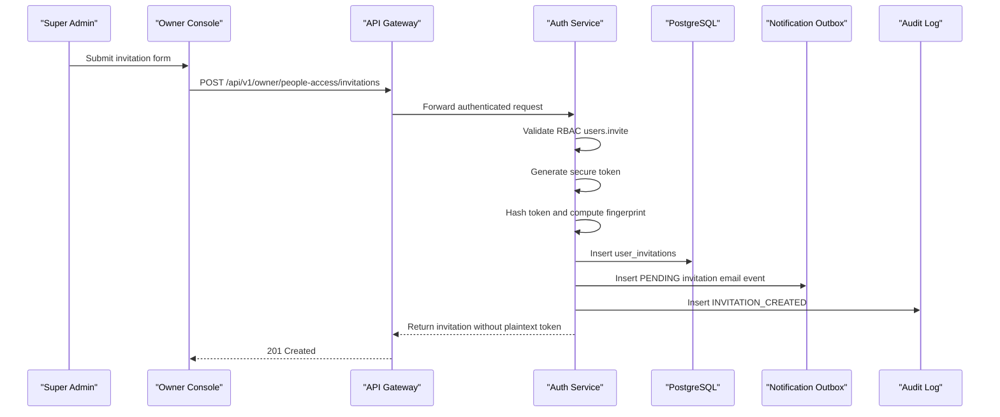
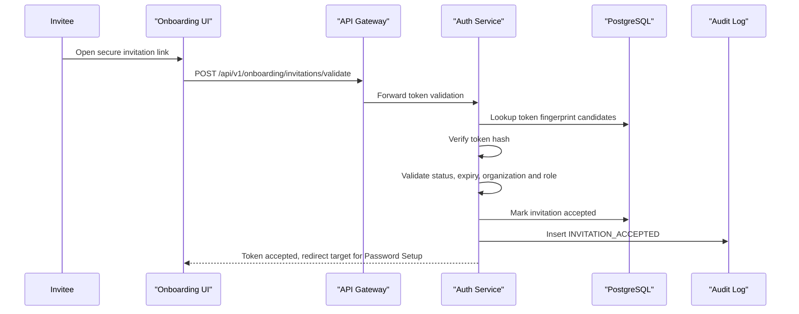
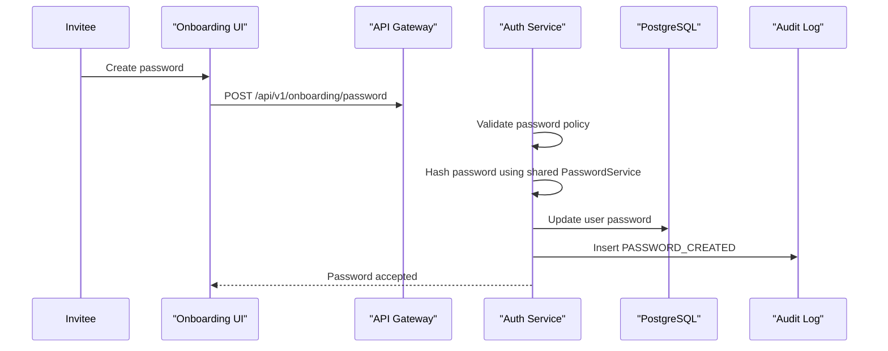
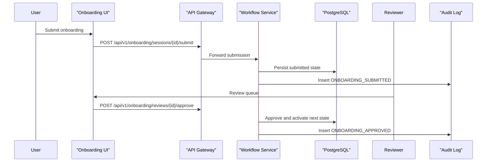

# Milestone 2 – Sequence Diagrams

Version: 1.0

Status: Architecture Approved

Owner: Platform Architecture

## Invitation Creation

## Invitation Acceptance

## Password Setup

## Onboarding Approval

